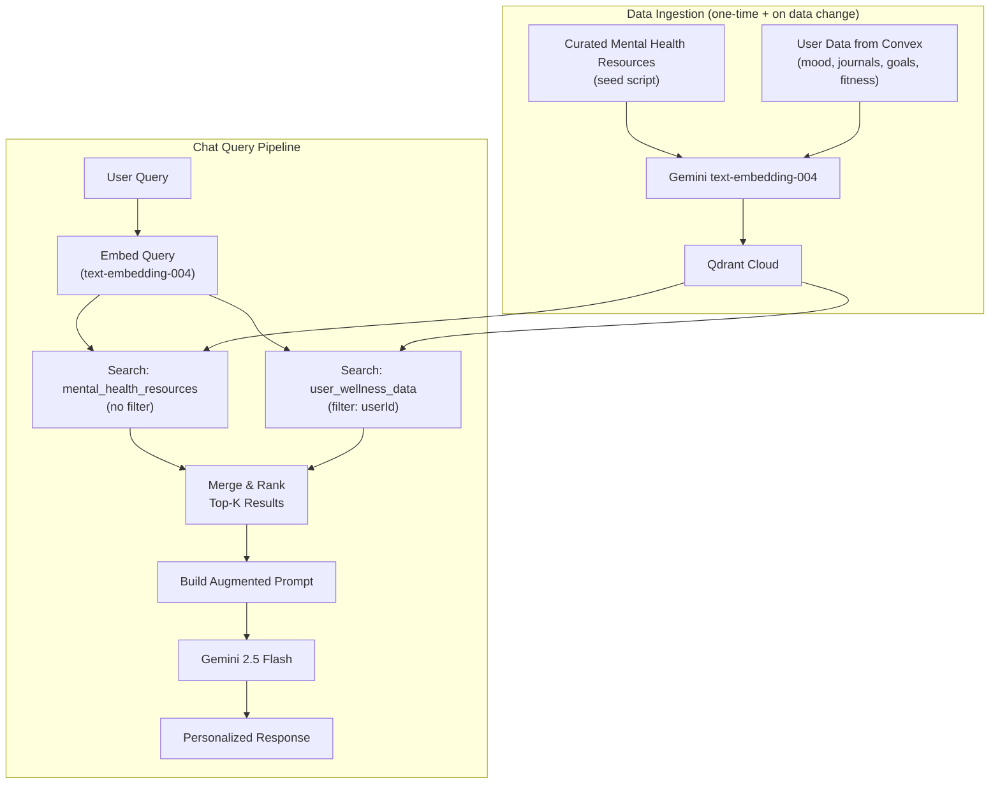

# True RAG Implementation with Qdrant + Gemini Embeddings

Replace the current context-stuffing approach with a proper Retrieval-Augmented Generation pipeline:

**Query → Embed → Semantic Search (Qdrant) → Retrieve Top-K → Augment Prompt → Gemini Response**

## Architecture



## Qdrant Collections

| Collection | Purpose | Filter | Content Examples |
|---|---|---|---|
| `mental_health_resources` | Curated knowledge base shared across all users | None | Anxiety coping strategies, sleep hygiene tips, CBT techniques, mindfulness guides |
| `user_wellness_data` | Per-user embedded wellness entries | `userId` | "On July 20, mood was 4/10 with high anxiety. Activities: work, no exercise. Note: feeling overwhelmed" |

Both use **768-dimension vectors** (Gemini `text-embedding-004`) with **Cosine** distance.

## Proposed Changes

### New Dependencies

```
@qdrant/js-client-rest  — Qdrant JavaScript client
```

(`@google/generative-ai` is already installed for embeddings)

---

### RAG Infrastructure

#### [NEW] [embeddings.ts](file:///Users/shwejan05/dev/Healio/lib/embeddings.ts)

Gemini embedding helper:
- `embedText(text)` → returns 768-dim float array
- `embedBatch(texts[])` → batch embed for ingestion efficiency
- Uses `text-embedding-004` with `RETRIEVAL_DOCUMENT` task type for indexing and `RETRIEVAL_QUERY` for search

#### [NEW] [qdrant.ts](file:///Users/shwejan05/dev/Healio/lib/qdrant.ts)

Qdrant client wrapper:
- Initializes `QdrantClient` from env vars (`QDRANT_URL`, `QDRANT_API_KEY`)
- `ensureCollections()` — creates both collections if they don't exist
- `upsertPoints(collection, points[])` — batch upsert with payload
- `search(collection, queryVector, filter?, limit?)` → returns scored results with payloads
- `deleteByFilter(collection, filter)` — for removing stale user data before re-sync

#### [NEW] [rag.ts](file:///Users/shwejan05/dev/Healio/lib/rag.ts)

RAG pipeline orchestrator:
- `retrieveContext(query, userId)`:
  1. Embeds the query with `RETRIEVAL_QUERY` task type
  2. Searches `mental_health_resources` (top 3, no filter)
  3. Searches `user_wellness_data` (top 5, filtered by `userId`)
  4. Merges results, deduplicates, and formats into a context string
- `formatRetrievedContext(results[])` — turns Qdrant payloads into a clean context block for the prompt

---

### Data Ingestion

#### [NEW] [mental-health-resources.ts](file:///Users/shwejan05/dev/Healio/lib/mental-health-resources.ts)

Curated corpus of ~30 mental health resource chunks covering:
- Anxiety management & coping strategies
- Stress reduction techniques
- Sleep hygiene best practices
- Mindfulness & meditation basics
- Depression awareness & self-care
- Cognitive behavioral techniques (CBT)
- Breathing exercises
- Benefits of journaling & gratitude
- Exercise and mental health connection
- Building social connections
- Setting healthy boundaries
- Crisis resources & when to seek help

Each chunk is a focused, ~100-200 word passage — small enough for precise retrieval.

#### [NEW] [route.ts](file:///Users/shwejan05/dev/Healio/app/api/rag/seed/route.ts)

POST endpoint to seed curated resources into Qdrant:
- Reads the resource corpus
- Batch-embeds all chunks
- Upserts into `mental_health_resources` collection
- Idempotent (uses deterministic IDs so re-running updates rather than duplicates)

#### [NEW] [route.ts](file:///Users/shwejan05/dev/Healio/app/api/rag/sync/route.ts)

POST endpoint to sync a user's data into Qdrant:
- Authenticated via Clerk `auth()`
- Fetches user data from Convex (mood entries, gratitude, goals, fitness)
- Converts each entry to a natural-language text description, e.g.:
  - Mood entry → `"On 2026-07-20, mood was 4/10, sleep 5.5hrs (quality 3/10), anxiety 7/10, stress 8/10. Activities: work, reading. Note: feeling overwhelmed with deadlines."`
  - Gratitude → `"Gratitude entry (2026-07-18): Grateful for a supportive friend who checked in on me."`
  - Goal → `"Active goal: 'Meditate for 10 minutes daily' (not yet completed, set on 2026-07-15)"`
- Deletes stale data for this user, then batch-embeds and upserts fresh data
- Returns `{ synced: true, count: N }`

---

### Modified Chat Route

#### [MODIFY] [route.ts](file:///Users/shwejan05/dev/Healio/app/api/chat/route.ts)

Replace the context-stuffing approach with the RAG pipeline:
1. Get authenticated userId via `auth()`
2. Call `retrieveContext(query, userId)` — embeds query, searches Qdrant, returns relevant chunks
3. Inject *only the retrieved chunks* into the Gemini prompt (not all user data)
4. The prompt clearly separates retrieved user data from curated resources

---

### Frontend — Trigger Sync on Chat Page Load

#### [MODIFY] [page.tsx](file:///Users/shwejan05/dev/Healio/app/(dashboard)/ai/page.tsx)

- Import `useUser` from Clerk
- On component mount, fire a `POST /api/rag/sync` call to ensure user data is fresh in Qdrant
- Show a subtle "Personalizing..." indicator while syncing
- Chat input remains usable during sync (will just have less context if sync hasn't finished)

---

## Environment Variables Needed

```env
QDRANT_URL=https://your-cluster.cloud.qdrant.io
QDRANT_API_KEY=your-qdrant-api-key
```

> [!IMPORTANT]
> You'll need a **Qdrant Cloud** account (free tier available at [cloud.qdrant.io](https://cloud.qdrant.io)). Create a cluster, grab the URL and API key, and add them to `.env.local`. Let me know once you have these, or if you want me to walk you through the setup.

## Open Questions

> [!NOTE]
> **Conversation history**: Should the RAG search also consider previous messages in the current session to improve retrieval? For example, if the user says "tell me more about that", we'd need the previous context to know what "that" refers to. This would mean sending the recent conversation history alongside the query for embedding.

## Verification Plan

### Automated Tests
- Run `next build` to verify all new files compile
- Run the seed script and verify resources are in Qdrant via the Qdrant dashboard

### Manual Verification
1. Seed curated resources via `POST /api/rag/seed`
2. Log in as a user with mood/journal data
3. Open the AI chat — verify sync call completes
4. Ask: *"What are some techniques for managing anxiety?"* → should retrieve curated resources
5. Ask: *"How have I been sleeping lately?"* → should retrieve relevant mood entries with sleep data
6. Ask: *"What should I focus on today?"* → should retrieve goals + recent mood
7. Check Qdrant dashboard to verify collections and point counts
